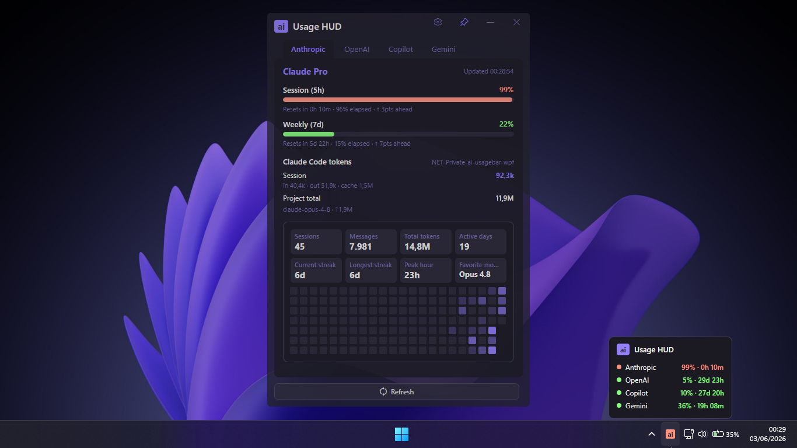
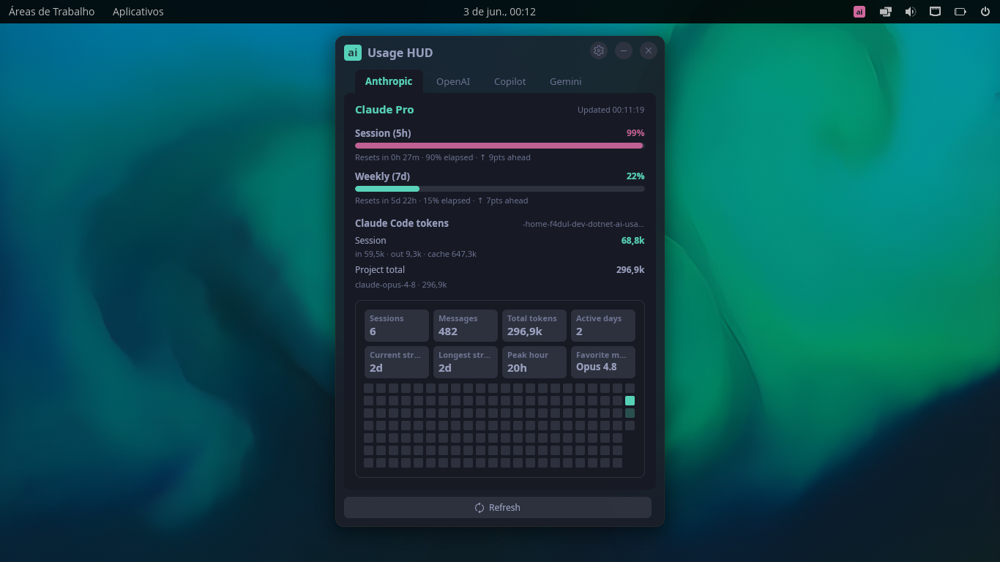

# AI Usage HUD

**Native-AOT, cross-platform** AI plan-usage monitor (Avalonia) for
**Anthropic Claude**, **OpenAI Codex/ChatGPT**, **GitHub Copilot** and
**Gemini CLI**, living in the system tray. Runs on **Windows** and **Linux**,
compiled ahead-of-time to a self-contained native executable that needs no .NET
runtime on the target (it ships next to Avalonia's handful of native render
libraries — Skia, HarfBuzz, ANGLE) — an Avalonia port of the original
`ai-usagebar` (Rust).

It reuses the credentials the official CLIs already wrote to disk (`claude`,
`codex`, `copilot` / `gh`, `gemini`) and calls the same undocumented usage
endpoints, so there is no separate in-app login.

> **Built for Native AOT from the ground up.** The entire stack is written to be
> reflection-free and trim-safe — source-generated JSON, compiled XAML bindings,
> and an AOT-compatible core — for near-instant startup, no JIT, and a low memory
> footprint. See [Native AOT](#native-aot-a-first-class-goal) for the specifics.

> **Theme it to match your setup.** A first-class focus: the app ships **59 built-in
> themes** — its signature **HUD** dark default plus faithful takes on the palettes
> you already use elsewhere (One Dark, Dracula, Tokyo Night, Catppuccin, Gruvbox,
> Nord, Solarized, GitHub, Ayu, Rosé Pine, and more). Switch live from **Settings**:
> every theme previews instantly with color swatches and the whole window recolors on
> the fly, so the HUD blends into whatever editor/terminal/desktop you're working in.

Supported vendors:

- Anthropic Claude
- OpenAI Codex / ChatGPT
- GitHub Copilot
- Google Gemini (Gemini CLI / Code Assist)

## Screenshots

| Windows | Linux (COSMIC) |
|:---:|:---:|
| [](docs/screenshots/windows.png) | [](docs/screenshots/linux.png) |

The main window shows one tab per vendor with usage gauges, reset countdowns and
pacing, plus local Claude Code / Codex token usage for the active project and a
per-day usage heatmap. The tray icon (bottom-right above) carries the active
vendor's id tinted by severity, with a hover card summarizing every vendor.

## Form Factor

- The app starts hidden in the system tray.
- Left-click the tray icon to open or focus the main window.
- The window shows one tab per enabled vendor with usage gauges, reset
  countdowns, pacing, credits, and related stats.
- Anthropic and OpenAI tabs also show local Claude Code / Codex token usage for
  the active project or workspace when those local logs are available.
- Pick from **59 built-in themes** in Settings — previews are instant and the whole
  window recolors live; the default is the app's own **HUD** dark theme.
- Closing the window hides it back to the tray.
- Use **Quit** from the tray menu to exit the app.
- The tray icon shows the active vendor's short id, colored by severity, plus a
  tooltip with compact usage information.

## Install

### Run from source

1. Install the .NET 10 SDK (no extra workload — the Avalonia head is cross-platform).
2. Authenticate the vendors you want to use.
3. Optionally create `%APPDATA%\ai-usage-hud\config.toml`.
4. Run the app.

Authentication prerequisites:

- Anthropic: run `claude` and sign in.
- OpenAI: run `codex login`.
- Copilot: sign in with the GitHub Copilot CLI or `gh auth login`.
- Gemini: run `gemini` and sign in (the CLI writes `~/.gemini/oauth_creds.json`).

```powershell
dotnet build
dotnet test
dotnet run --project src/AiUsageHud.App
```

### Build a distributable executable

The app publishes as a self-contained **Native-AOT** executable — no .NET runtime on
the target — alongside Avalonia's native render libraries (`libSkiaSharp`,
`libHarfBuzzSharp`, `av_libglesv2`), which can't be linked into the managed AOT image.
Every AOT/trim/size setting lives in the app project, so a **bare** publish does the
right thing (no extra `-p:` flags):

```powershell
dotnet publish -c Release -r win-x64    # Windows
dotnet publish -c Release -r linux-x64  # Linux
```

Only the app head is published — the libraries are marked `IsPublishable=false`, so a
solution-level publish emits just the app (they are still built and bundled as its
dependencies). The output lands under `src/AiUsageHud.App/bin/Release/net10.0/<rid>/publish/`
as the `AiUsageHud` executable plus the three native render `.dll`/`.so` files above — to
distribute, ship that folder (the `.pdb` files are optional debug symbols).
See [Native AOT](#native-aot-a-first-class-goal) for what's enabled and the toolchain it needs.

This publish mode is framework-dependent, so the target machine needs the .NET
10 Runtime installed. (For a self-contained build that needs no runtime on the
target, use the Native AOT publish below.)

## Layout

The Avalonia head sits on top of a platform-neutral core and shared view models:

```
src/
  AiUsageHud.Core/         # platform-neutral core (no UI framework) — all logic + networking
  AiUsageHud.Presentation/ # shared view models + abstractions (IUiDispatcher, IThemeService)
  AiUsageHud.App/  # Avalonia head — UI + tray
  AiUsageHud.Core.Tests/   # xUnit suite (ported from the Rust tests)
```

`AiUsageHud.Core` mirrors the Rust crate module-for-module: `Models`, `Pacing`
(pacing/countdown/severity), `Config` (+ `AppPaths`, `ConfigWriter`), `Caching`
(atomic write + TTL + lock + last-error), and one folder per vendor
(`Vendors/Anthropic`, `OpenAi`, `Copilot`, `Gemini`) with `Types` / `Creds` /
`OAuth` / `Fetcher`. `UsageService` is the orchestrator.
`Core/Theming/PaletteColors.cs` is the single source of truth for the 59 theme
palettes.

`AiUsageHud.Presentation` holds every view model (`MainViewModel`,
`VendorTabViewModel`, `SettingsViewModel`, the section/dashboard VMs,
`ThemeOption`) plus `OpacityManager` and the framework-agnostic abstractions the
head implements: `IUiDispatcher` (timer) and `IThemeService` (palette swap). The
head is thin — only XAML + framework interop (window chrome, animations, tray,
icon rendering).

### Hand-rolled theming

`Themes/Controls.axaml` deliberately does **not** use a prebuilt Avalonia theme —
it re-templates every visible control by hand (borderless window, tabs, gauges,
dashboard/heatmap, settings overlay and palettes). `Avalonia.Themes.Simple` is
included only as structural plumbing for controls that aren't drawn directly
(`ScrollViewer`/`ItemsControl`), and is fully overridden.

### Theme palettes (single source of truth)

The 59 palettes live in `tools/palettes.json`. Run the generator to (re)emit the
C# table — never hand-edit the generated files. The Avalonia head builds every
palette at runtime from `PaletteColors.cs`, so it needs only `OneDark.axaml` (the
compile-time default in `App.axaml`), which the generator also emits:

```powershell
pwsh tools/Generate-Palettes.ps1            # PaletteColors.cs + Avalonia OneDark.axaml
```

## Paths

| Purpose            | Windows                                       | Linux                                  |
|--------------------|-----------------------------------------------|----------------------------------------|
| Config             | `%APPDATA%\ai-usage-hud\config.toml`           | `~/.config/ai-usage-hud/config.toml`    |
| Cache (per vendor) | `%LOCALAPPDATA%\ai-usage-hud\<vendor>\`        | `~/.local/share/ai-usage-hud/<vendor>/` |
| Anthropic creds    | `%USERPROFILE%\.claude\.credentials.json`     | `~/.claude/.credentials.json`          |
| OpenAI creds       | `%USERPROFILE%\.codex\auth.json`              | `~/.codex/auth.json`                   |
| Copilot creds      | Windows Credential Manager (`copilot-cli` / `gh`) | `~/.config/gh/hosts.yml` (gh CLI)  |
| Gemini creds       | `%USERPROFILE%\.gemini\oauth_creds.json`      | `~/.gemini/oauth_creds.json`           |

## Configuration

Optional `config.toml` (defaults enable all vendors). Same shape as the Rust
project:

```toml
[ui]
# primary = "anthropic"   # anthropic | openai | copilot | gemini

[anthropic]
enabled = true
# credentials_path = "C:/Users/name/.claude/.credentials.json"

[openai]
enabled = true
# codex_auth_path = "C:/Users/name/.codex/auth.json"

[copilot]
enabled = true
# oauth_token = "gho_..."   # explicit override; otherwise read from the OS (Credential
#                           # Manager on Windows, gh hosts.yml on Linux)

[gemini]
enabled = true
# credentials_path = "..."  # override ~/.gemini/oauth_creds.json
# project_id = "..."        # Code Assist project; otherwise resolved via loadCodeAssist
group_by_variant = true     # collapse models into variants (Flash/Pro…), each showing its
#                           # highest usage; false lists every model
```

The in-app **Settings** dialog edits `[ui]` (primary, theme, opacity, launch-at-login),
preserving the file's comments and unrelated fields. `[gemini].group_by_variant` is
file-only for now.

## Build, Test, And Publish

```powershell
dotnet build
dotnet test                                      # 108 tests
dotnet run --project src/AiUsageHud.App  # Avalonia head
```

Requires the .NET 10 SDK. The app builds the tray glyph at runtime and starts
hidden to the tray.

### Tray per platform

The tray is split behind `ITrayController`:

- **Windows** (`WindowsTrayController`) — a Win32 `Shell_NotifyIcon` with a fully
  Avalonia-styled context menu and a rich hover card.
- **Linux** (`LinuxTrayController`) — Avalonia's cross-platform `TrayIcon` +
  `NativeMenu`. The StatusNotifierItem model (GNOME/KDE/waybar, over DBus) gives no
  per-icon hover/move events and lets the desktop shell own the menu, so the hover
  card and hand-styled menu are Windows-only; Linux gets the native menu (Open /
  Refresh all / vendor switch / Quit). The "ai" glyph is rendered with Skia
  (`TrayGlyphRenderer`), so no `System.Drawing` is needed there.

### Native AOT (a first-class goal)

Native AOT compilation was a design constraint, not an afterthought — the code is
written to compile cleanly with the ILC linker and run without a JIT or runtime
reflection. Concretely:

- **AOT enabled end to end.** The app head sets `PublishAot=true`; `AiUsageHud.Core`
  and `AiUsageHud.Presentation` set `IsAotCompatible=true`, which turns on the
  trim/AOT analyzers so any reflection or trim hazard surfaces as a build warning.
- **Reflection-free JSON.** Every DTO is registered in a `System.Text.Json` source-
  generation context (`Core/Json/AppJsonContext.cs`) — serialization metadata is
  emitted at compile time, so there is no `Reflection.Emit` on the wire paths.
- **Compiled XAML bindings.** `AvaloniaUseCompiledBindingsByDefault=true` makes the
  UI bindings compile-time typed, avoiding the reflection-based binding fallback.
- **Explicit trimmer roots.** The TOML parser (`Tomlyn`) is used only through its
  document model, so it is kept via `TrimmerRootAssembly` to guarantee the linker
  never strips a path that is reached at runtime.
- **Publish settings in the project.** `TrimMode=full`, `InvariantGlobalization` and the
  trimmed feature switches (`DebuggerSupport`/`EventSourceSupport`/`StackTraceSupport`)
  live in the app `.csproj` under a RID-guarded property group — so they apply only to
  `-r`-targeted publishes, never to `dotnet run` / Debug or CI's `dotnet build`.

A self-contained, AOT-compiled executable (no .NET runtime required on the target)
comes out of a bare publish — the native render libraries (`libSkiaSharp`,
`libHarfBuzzSharp`, `av_libglesv2`) sit beside it in the publish folder:

```powershell
dotnet publish -c Release -r win-x64    # on Windows
dotnet publish -c Release -r linux-x64  # on Linux
```

> Native AOT does **not** cross-compile between operating systems — each target must be
> published **on that OS**. On Windows the native link step needs the MSVC toolchain +
> Windows SDK, so run it from a **Developer PowerShell for VS** (or any shell where
> `vswhere` / `link.exe` are on `PATH`). The Linux publish needs `clang` and `zlib`
> (e.g. `apt install clang zlib1g-dev`).

## Differences from the original (Rust / Waybar)

- Tray icon + window instead of the Waybar widget and terminal TUI.
- No Omarchy theme integration.
- The default theme is **HUD** (the app's own theme), and it ships 59 built-in palettes.
- No `SIGRTMIN` signaling; the app auto-refreshes on a 60-second `DispatcherTimer`.
- File locking uses `FileShare.None` retries instead of `flock`.
- Config and cache live in per-user profile directories (Windows `%APPDATA%` /
  `%LOCALAPPDATA%`, Linux XDG `~/.config` / `~/.local/share`).
